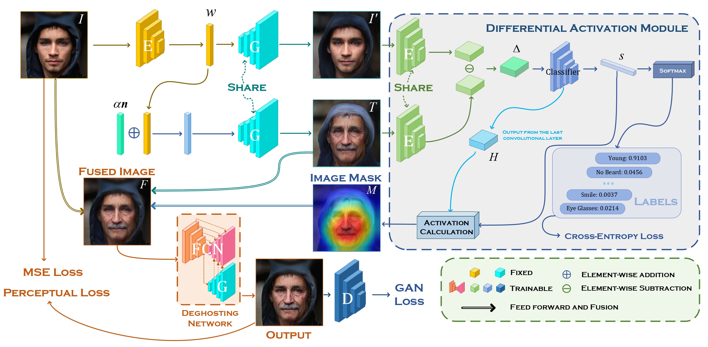

# Editing-Out-of-Domain

## Overview
Despite the demonstrated editing capacity in the latent space of a pretrained GAN model, inverting real-world images is stuck in a dilemma that the reconstruction cannot be faithful to the original input. The main reason for this is that the distributions between training and real-world data are misaligned, and because of that, it is unstable of GAN inversion for real image editing. In this paper, we propose a novel GAN prior based editing framework to tackle the out-of-domain inversion problem with a composition-decomposition paradigm. In particular, during the phase of composition, we introduce a differential activation module for detecting semantic changes from a global perspective, \ie, the relative gap between the features of edited and unedited images. With the aid of the generated Diff-CAM mask, a coarse reconstruction can intuitively be composited by the paired original and edited images. In this way, the attribute-irrelevant regions can be survived in almost whole, while the quality of such an intermediate result is still limited by an unavoidable ghosting effect. Consequently, in the decomposition phase, we further present a GAN prior based deghosting network for separating the final fine edited image from the coarse reconstruction. Extensive experiments exhibit superiorities over the state-of-the-art methods, in terms of qualitative and quantitative evaluations. The robustness and flexibility of our method is also validated on both scenarios of single attribute and multi-attribute manipulations.



## Prerequisite
+ Linux
+ NVIDIA GPU + CUDA CuDNN
+ Python 3.7
+ Pytorch >= 1.7, torchvision >= 0.8.2
+ [mmcv-full](https://github.com/open-mmlab/mmcv) is required for some modules. The installation can be done as follows:
  ```
  pip install mmcv-full
  ```
+ other packages (ttach, opencv-python):
  ```
  pip install ttach opencv-python
  ```
+ more detailed environment configuration can be found in `environment.yaml`, which is directly exported by anaconda.

## Getting Started

### Preparation
+ Clone the repository and enter the main folder.
  ```
  git clone git@github.com:HaoruiSong622/Editing-Out-of-Domain.git
  cd Editing-Out-of-Domain
  ```
+ Download the pretrained checkpoints.
  | Path | Description |  
  | :--- | :---------- |  
  |[diff_cam_weight.pt](https://drive.google.com/file/d/10d4QL4BRNvY-AyxMQhHsnoQ7vZz0Q_Zh/view?usp=sharing)  | The weight for the DiffCAM in our model. |  
  |[deghosting.pt](https://drive.google.com/file/d/1gfb1M8mFl4GlEiQsGDWjJRQ5zetrVbi0/view?usp=sharing)  | The weight for the deghosting network.  |  
  Here we chose [pSp](https://github.com/eladrich/pixel2style2pixel) encoder to do StyleGAN Inversion. Please Download the pretrained pSp [checkpoint](https://drive.google.com/file/d/1bMTNWkh5LArlaWSc_wa8VKyq2V42T2z0/view?usp=sharing).

### Run the Demonstration
```pycon
python image_process.py --device 0
--diffcam_ckpt_path path_to_diffcam_weight
--deghosting_ckpt_path path_to_deghosting_weight
--direction_path ./directions/Beard.npy
--image_dir ./sample_images
--output_dir path_to_output_dir
--psp_ckptpath path_to_psp_encoder_ffhq_weight
```
